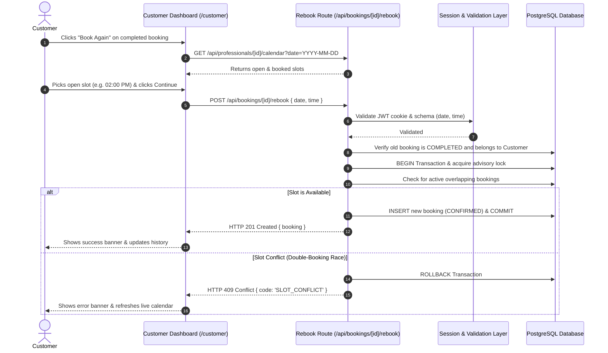

# System Architecture & Technical Design

## 1. Core Data Model

The data layer is built with **Prisma 8 (Prisma Next)** using a contract-first schema defined in `prisma/contract.prisma`.

```mermaid
erDiagram
    USER ||--o| PROFESSIONAL : "userId (1:1 optional)"
    USER ||--o{ BOOKING : "customerId (1:N)"
    PROFESSIONAL ||--o{ BOOKING : "professionalId (1:N)"

    USER {
        int id PK
        string email UK
        string password
        string name
        string role "CUSTOMER | PROFESSIONAL"
        string phone
        string address
        datetime createdAt
        datetime updatedAt
    }

    PROFESSIONAL {
        int id PK
        string name
        string phone
        int userId FK UK
        datetime createdAt
        datetime updatedAt
    }

    BOOKING {
        int id PK
        string service
        datetime bookingDate
        string status "COMPLETED | CONFIRMED | HELD | CANCELLED"
        int customerId FK
        int professionalId FK
        datetime createdAt
        datetime updatedAt
    }
```

### Key Enums & Rules
- **`UserRole`**: `CUSTOMER` or `PROFESSIONAL`.
- **`BookingStatus`**: `COMPLETED`, `CONFIRMED`, `HELD`, `CANCELLED`.
- **Relationship Integrity**: Re-booking only applies to past bookings with status `COMPLETED`. Creating a re-booking generates a **new** record with status `CONFIRMED` while preserving the original completed booking history untouched.

---

## 2. Shared Availability & Overlap Engine (`src/lib/availability.ts`)

To avoid timezone bugs and duplicate booking logic, the application uses a unified, deterministic availability engine:

### Timezone & Standard Slots (IST +05:30)
- Operating timezone is Indian Standard Time (`+05:30`).
- Standard daily service windows (2.5 hours / 150 minutes duration):
  1. `09:00 AM` (09:00 - 11:30)
  2. `11:30 AM` (11:30 - 14:00)
  3. `02:00 PM` (14:00 - 16:30)
  4. `04:30 PM` (16:30 - 19:00)
  5. `07:00 PM` (19:00 - 21:30)

### Mathematical Overlap Invariant
Two intervals $[A_{\text{start}}, A_{\text{end}})$ and $[B_{\text{start}}, B_{\text{end}})$ overlap if and only if:
$$\text{Overlap} \iff A_{\text{start}} < B_{\text{end}} \quad\land\quad B_{\text{start}} < A_{\text{end}}$$

- Cancelled bookings (`status === 'CANCELLED'`) are automatically omitted from conflict calculations.
- Shared between:
  - `GET /api/professionals/[id]/calendar` → renders slot statuses (`OPEN`, `BOOKED`, `HELD`).
  - `POST /api/bookings/[bookingId]/rebook` → validates requested slot availability before reservation.

---

## 3. Concurrency Protection & Transaction Safety

To prevent double-booking race conditions when multiple customers attempt to book the same slot simultaneously:

1. **PostgreSQL Advisory Transaction Locks**:
   ```sql
   SELECT pg_advisory_xact_lock(hashtext('booking_' || professionalId || '_' || requestedStart));
   ```
   Locks specifically on the `(professionalId, requestedStart)` key for the duration of the SQL transaction, serializing competing requests without bottlenecking unrelated professionals.

2. **Database Partial Unique Index**:
   ```sql
   CREATE UNIQUE INDEX IF NOT EXISTS unique_active_booking_slot
   ON public.booking ("professionalId", "bookingDate")
   WHERE status != 'CANCELLED';
   ```
   Acts as a database-level safety net guaranteeing zero double bookings even across distributed serverless instances.

---

## 4. End-to-End Re-booking Flow


